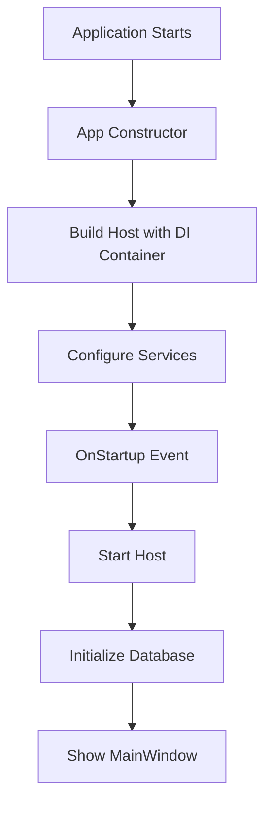
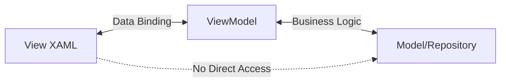
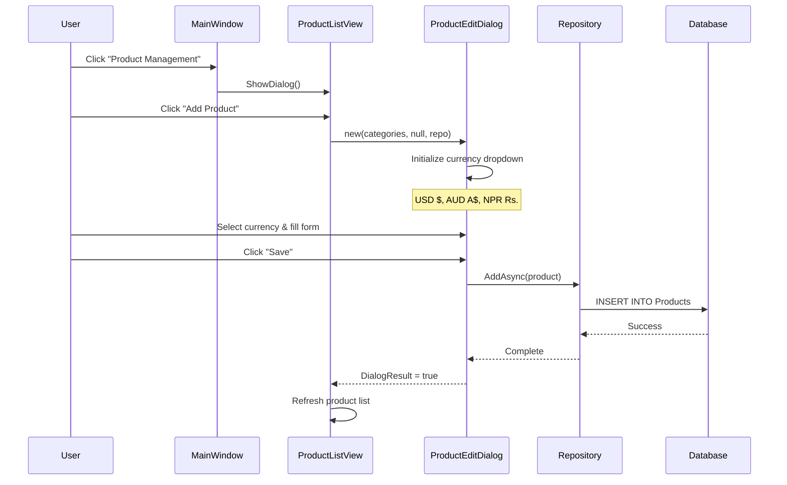

```mermaid
sequenceDiagram
    User->>ProductEditDialog: Click "📂 Manage"
    ProductEditDialog->>CategoryManagementDialog: new(categoryRepository)
    CategoryManagementDialog->>Repository: GetAllAsync()
    Repository-->>CategoryManagementDialog: List<Category>
    CategoryManagementDialog->>UI: Display categories
    User->>CategoryManagementDialog: Add/Edit/Delete category
    CategoryManagementDialog->>Repository: AddAsync/UpdateAsync/DeleteAsync
    Repository->>Database: SQL operation
    Database-->>Repository: Success
    CategoryManagementDialog->>CategoryManagementDialog: Reload list
    User->>CategoryManagementDialog: Click "Close"
    CategoryManagementDialog-->>ProductEditDialog: CategoriesChanged = true
    ProductEditDialog->>Repository: GetAllAsync()
    ProductEditDialog->>ProductEditDialog: Refresh dropdown
```

# Walsong TradeMaster - Complete Code Walkthrough & Architecture Guide

## Table of Contents
1. [Application Overview](#application-overview)
2. [Project Structure](#project-structure)
3. [Application Startup Flow](#application-startup-flow)
4. [Architecture Layers](#architecture-layers)
5. [Database Layer](#database-layer)
6. [MVVM Pattern Implementation](#mvvm-pattern-implementation)
7. [Navigation Flow](#navigation-flow)
8. [Key Features Walkthrough](#key-features-walkthrough)
9. [Debugging Guide](#debugging-guide)

---

## Application Overview

**Walsong TradeMaster** is an enterprise-level inventory and sales management system built with:
- **Frontend**: WPF (Windows Presentation Foundation) with MVVM pattern
- **Backend**: .NET 9.0 with Entity Framework Core
- **Database**: SQLite (lightweight, file-based)
- **DI Container**: Microsoft.Extensions.DependencyInjection
- **Architecture**: Clean Architecture (Core → Infrastructure → Desktop)

---

## Project Structure

```
TradeMaster/
├── TradeMaster.Core/              # Domain layer (entities, interfaces)
│   ├── Entities/                  # Business entities (Product, Category, Sale, etc.)
│   └── Interfaces/                # Repository interfaces
├── TradeMaster.Infrastructure/    # Data access layer
│   ├── Data/                      # DbContext, repositories, migrations
│   └── Migrations/                # EF Core migrations
├── TradeMaster.Desktop/           # Presentation layer (WPF)
│   ├── Views/                     # XAML views
│   ├── ViewModels/                # View models (MVVM)
│   ├── Services/                  # Application services
│   ├── Converters/                # Value converters
│   └── Helpers/                   # Utility classes
└── TradeMaster.Tests/             # Unit tests
```

### Dependency Flow
```
Desktop (UI) → Infrastructure (Data) → Core (Domain)
```
- **Core** has no dependencies (pure domain logic)
- **Infrastructure** depends on Core (implements interfaces)
- **Desktop** depends on both (uses services and entities)

---

## Application Startup Flow

### 1. Entry Point: `App.xaml` & `App.xaml.cs`

**File**: [App.xaml.cs](file:///d:/AntigravityProjects/C%23%20Projects/TradeMaster/TradeMaster.Desktop/App.xaml.cs)



#### Step-by-Step Breakdown:

**Step 1: Constructor (Lines 17-62)**
```csharp
public App()
{
    AppHost = Host.CreateDefaultBuilder()
        .ConfigureServices((hostContext, services) => { ... })
        .Build();
}
```
- Creates a **Host** (DI container)
- Registers all services, repositories, and views

**Step 2: Service Registration**

| Service Type | Lifetime | Purpose |
|-------------|----------|---------|
| `TradeMasterDbContext` | Scoped | Database access |
| `IRepository<>` | Scoped | Generic CRUD operations |
| `SettingsService` | Singleton | App-wide settings |
| `ProductListViewModel` | Transient | Fresh instance per view |
| `MainWindow` | Singleton | Single main window |

**Step 3: OnStartup (Lines 64-80)**
```csharp
protected override async void OnStartup(StartupEventArgs e)
{
    await AppHost!.StartAsync();
    
    // Initialize Database
    using (var scope = AppHost.Services.CreateScope())
    {
        var context = scope.ServiceProvider.GetRequiredService<TradeMasterDbContext>();
        DbInitializer.Initialize(context);
    }
    
    // Show Main Window
    var startupForm = AppHost.Services.GetRequiredService<MainWindow>();
    startupForm.Show();
}
```

**What Happens:**
1. ✅ Start the host (activate DI container)
2. ✅ Create a service scope
3. ✅ Get `TradeMasterDbContext` from DI
4. ✅ Call `DbInitializer.Initialize()` → runs migrations, creates DB
5. ✅ Resolve `MainWindow` from DI (with all dependencies injected)
6. ✅ Show the main window

---

## Architecture Layers

### Layer 1: Core (Domain)

**Location**: `TradeMaster.Core/`

#### Entities

All business entities inherit from base classes and use data annotations:

**Example: Product Entity**
```csharp
public class Product
{
    public int Id { get; set; }
    
    [Required]
    [MaxLength(200)]
    public string Name { get; set; }
    
    [Column(TypeName = "decimal(18,2)")]
    public decimal Price { get; set; }
    
    [MaxLength(10)]
    public string Currency { get; set; } = "USD";  // NEW: Multi-currency
    
    public int CategoryId { get; set; }
    public Category? Category { get; set; }  // Navigation property
}
```

#### Interfaces

**`IRepository<T>`** - Generic repository pattern:
```csharp
public interface IRepository<T> where T : class
{
    Task<T?> GetByIdAsync(int id);
    Task<IEnumerable<T>> GetAllAsync();
    Task<IEnumerable<T>> FindAsync(Expression<Func<T, bool>> predicate);
    Task AddAsync(T entity);
    Task UpdateAsync(T entity);
    Task DeleteAsync(T entity);
}
```

### Layer 2: Infrastructure (Data Access)

**Location**: `TradeMaster.Infrastructure/Data/`

#### DbContext

**File**: [TradeMasterDbContext.cs](file:///d:/AntigravityProjects/C%23%20Projects/TradeMaster/TradeMaster.Infrastructure/Data/TradeMasterDbContext.cs)

```csharp
public class TradeMasterDbContext : DbContext
{
    public DbSet<Product> Products { get; set; }
    public DbSet<Category> Categories { get; set; }
    public DbSet<Sale> Sales { get; set; }
    public DbSet<Customer> Customers { get; set; }
    
    protected override void OnModelCreating(ModelBuilder modelBuilder)
    {
        // Seed initial data
        modelBuilder.Entity<Category>().HasData(
            new Category { Id = 1, Name = "Electronics" },
            new Category { Id = 2, Name = "Groceries" }
        );
    }
}
```

**Key Methods:**
- `OnConfiguring()` - Sets SQLite connection string
- `OnModelCreating()` - Seeds initial data, configures relationships

#### Repository Implementation

**File**: [EfRepository.cs](file:///d:/AntigravityProjects/C%23%20Projects/TradeMaster/TradeMaster.Infrastructure/Data/EfRepository.cs)

```csharp
public class EfRepository<T> : IRepository<T> where T : class
{
    protected readonly TradeMasterDbContext _context;
    
    public async Task<IEnumerable<T>> GetAllAsync()
    {
        return await _context.Set<T>().ToListAsync();
    }
    
    public async Task AddAsync(T entity)
    {
        await _context.Set<T>().AddAsync(entity);
        await _context.SaveChangesAsync();  // Commits to DB
    }
}
```

**How It Works:**
1. Generic `Set<T>()` gets the DbSet for entity type T
2. EF Core translates LINQ to SQL queries
3. `SaveChangesAsync()` commits transaction to SQLite file

#### Database Initialization

**File**: [DbInitializer.cs](file:///d:/AntigravityProjects/C%23%20Projects/TradeMaster/TradeMaster.Infrastructure/Data/DbInitializer.cs)

```csharp
public static void Initialize(TradeMasterDbContext context)
{
    context.Database.Migrate();  // Apply pending migrations
    
    if (context.Products.Any())
        return;  // Already seeded
}
```

**Migration Flow:**
```
1. Check for trademaster.db file
2. If missing → Create database
3. Apply all migrations from Migrations/ folder
4. Seed data from OnModelCreating()
```

### Layer 3: Desktop (Presentation)

**Location**: `TradeMaster.Desktop/`

Uses **MVVM Pattern** (Model-View-ViewModel)

---

## MVVM Pattern Implementation

### The MVVM Triangle



### Example: Product Management

#### 1. View (XAML)

**File**: [ProductListView.xaml](file:///d:/AntigravityProjects/C%23%20Projects/TradeMaster/TradeMaster.Desktop/Views/ProductListView.xaml)

```xml
<Window DataContext="{Binding}">
    <DataGrid ItemsSource="{Binding Products}"
              SelectedItem="{Binding SelectedProduct}">
        <DataGridTextColumn Header="Name" Binding="{Binding Name}"/>
        <DataGridTextColumn Header="Price" Binding="{Binding Price}"/>
    </DataGrid>
    
    <Button Content="Add Product" Command="{Binding AddProductCommand}"/>
</Window>
```

**Key Concepts:**
- `ItemsSource="{Binding Products}"` → Binds to ViewModel's Products property
- `Command="{Binding AddProductCommand}"` → Executes ViewModel method

#### 2. ViewModel

**File**: [ProductListViewModel.cs](file:///d:/AntigravityProjects/C%23%20Projects/TradeMaster/TradeMaster.Desktop/ViewModels/ProductListViewModel.cs)

```csharp
public partial class ProductListViewModel : ObservableObject
{
    private readonly IRepository<Product> _productRepository;
    
    [ObservableProperty]  // Auto-generates property with INotifyPropertyChanged
    private ObservableCollection<Product> _products = new();
    
    [ObservableProperty]
    private Product? _selectedProduct;
    
    [RelayCommand]  // Auto-generates ICommand
    private async Task AddProduct()
    {
        var dialog = new ProductEditDialog(categories);
        if (dialog.ShowDialog() == true)
        {
            await _productRepository.AddAsync(dialog.Product);
            Products.Add(dialog.Product);  // UI auto-updates!
        }
    }
}
```

**How It Works:**
1. `[ObservableProperty]` generates `OnPropertyChanged` events
2. When `Products` changes → UI automatically updates
3. `[RelayCommand]` creates bindable commands for buttons
4. ViewModel talks to repository, never directly to View

#### 3. View Code-Behind

**File**: `ProductListView.xaml.cs`

```csharp
public partial class ProductListView : Window
{
    public ProductListView(ProductListViewModel viewModel)
    {
        InitializeComponent();
        DataContext = viewModel;  // Connect View to ViewModel
    }
}
```

**Minimal code** - just sets DataContext. All logic in ViewModel!

---

## Navigation Flow

### Main Window Navigation

**File**: [MainWindow.xaml.cs](file:///d:/AntigravityProjects/C%23%20Projects/TradeMaster/TradeMaster.Desktop/MainWindow.xaml.cs)

```csharp
public partial class MainWindow : Window
{
    private readonly IServiceProvider _serviceProvider;
    
    private void ProductManagementButton_Click(object sender, RoutedEventArgs e)
    {
        var productListView = _serviceProvider.GetRequiredService<ProductListView>();
        productListView.ShowDialog();  // Modal dialog
        RefreshStats();  // Update dashboard after closing
    }
}
```

**Navigation Pattern:**
```
MainWindow (Dashboard)
    ├─→ ProductListView (Modal)
    │     └─→ ProductEditDialog (Modal)
    │           └─→ CategoryManagementDialog (Modal)
    ├─→ PosView (Modal)
    ├─→ CustomerListView (Modal)
    ├─→ SalesHistoryView (Modal)
    └─→ SettingsView (Modal)
```

**Why Modal Dialogs?**
- Prevents multiple windows open simultaneously
- Forces user to complete action before returning
- Easier state management

---

## Key Features Walkthrough

### Feature 1: Multi-Currency Product Management

#### Flow Diagram


#### Code Flow

**1. User Clicks "Add Product"**
```csharp
// ProductListViewModel.cs
[RelayCommand]
private async Task AddProduct()
{
    var categories = await _categoryRepository.GetAllAsync();
    var dialog = new ProductEditDialog(
        categories.ToList(), 
        null,  // No existing product (add mode)
        _categoryRepository
    );
    
    if (dialog.ShowDialog() == true && dialog.Product != null)
    {
        await _productRepository.AddAsync(dialog.Product);
        Products.Add(dialog.Product);  // Updates UI
    }
}
```

**2. Dialog Initializes**
```csharp
// ProductEditDialog.xaml.cs
public ProductEditDialog(List<Category> categories, Product? existingProduct, 
                        IRepository<Category>? categoryRepository)
{
    InitializeComponent();
    
    // Initialize currency options
    CurrencyComboBox.ItemsSource = new[]
    {
        new { Code = "USD", Display = "USD $" },
        new { Code = "AUD", Display = "AUD A$" },
        new { Code = "NPR", Display = "NPR Rs." }
    };
    CurrencyComboBox.SelectedValue = "USD";  // Default
    
    CategoryComboBox.ItemsSource = categories;
}
```

**3. User Saves Product**
```csharp
private void SaveButton_Click(object sender, RoutedEventArgs e)
{
    if (!ValidateInputs()) return;
    
    Product = new Product
    {
        Name = NameTextBox.Text.Trim(),
        CategoryId = (int)CategoryComboBox.SelectedValue,
        Currency = CurrencyComboBox.SelectedValue?.ToString() ?? "USD",
        Price = decimal.Parse(PriceTextBox.Text),
        StockQuantity = int.Parse(StockTextBox.Text)
    };
    
    DialogResult = true;  // Signals success to caller
    Close();
}
```

### Feature 2: Category Management

#### Flow Diagram


#### Code Flow

**1. Open Category Management**
```csharp
// ProductEditDialog.xaml.cs
private async void ManageCategories_Click(object sender, RoutedEventArgs e)
{
    var dialog = new CategoryManagementDialog(_categoryRepository);
    dialog.ShowDialog();
    
    // Reload categories if changed
    if (dialog.CategoriesChanged)
    {
        _categories = (await _categoryRepository.GetAllAsync()).ToList();
        var selectedId = CategoryComboBox.SelectedValue;
        CategoryComboBox.ItemsSource = _categories;
        CategoryComboBox.SelectedValue = selectedId;  // Restore selection
    }
}
```

**2. Add Category**
```csharp
// CategoryManagementDialog.xaml.cs
private async void AddCategory_Click(object sender, RoutedEventArgs e)
{
    var name = CategoryNameTextBox.Text?.Trim();
    
    if (string.IsNullOrWhiteSpace(name))
    {
        ShowValidation("Category name is required.");
        return;
    }
    
    // Check for duplicates
    if (_categories.Any(c => c.Name.Equals(name, StringComparison.OrdinalIgnoreCase)))
    {
        ShowValidation("A category with this name already exists.");
        return;
    }
    
    var category = new Category
    {
        Name = name,
        Description = CategoryDescriptionTextBox.Text?.Trim()
    };
    
    await _categoryRepository.AddAsync(category);
    CategoriesChanged = true;  // Flag for parent dialog
    LoadCategories();  // Refresh list
}
```

### Feature 3: Settings Management

#### Code Flow

**1. Load Settings**
```csharp
// SettingsViewModel.cs
private void LoadSettings()
{
    var settings = _settingsService.Settings;
    
    CompanyName = settings.CompanyName;
    CurrencySymbol = settings.CurrencySymbol;
    SelectedLanguage = settings.Language;
}
```

**2. Save Settings**
```csharp
[RelayCommand]
private void SaveSettings()
{
    _settingsService.UpdateSetting(s =>
    {
        s.CompanyName = CompanyName;
        s.CurrencySymbol = CurrencySymbol;
        s.Language = SelectedLanguage;
    });
    
    MessageBox.Show("Settings saved successfully!");
}
```

**3. Settings Persistence**
```csharp
// SettingsService.cs
public void UpdateSetting(Action<AppSettings> updateAction)
{
    updateAction(_settings);  // Modify settings
    SaveSettings();  // Write to appsettings.json
}

private void SaveSettings(AppSettings settings)
{
    var json = JsonSerializer.Serialize(settings, new JsonSerializerOptions 
    { 
        WriteIndented = true 
    });
    File.WriteAllText(SettingsFilePath, json);
}
```

---

## Debugging Guide

### Common Debugging Scenarios

#### 1. Application Won't Start

**Check:**
```csharp
// App.xaml.cs - OnStartup
protected override async void OnStartup(StartupEventArgs e)
{
    try
    {
        await AppHost!.StartAsync();
        // ... rest of code
    }
    catch (Exception ex)
    {
        MessageBox.Show($"Startup Error: {ex.Message}");
    }
}
```

**Common Issues:**
- ❌ Database file locked → Close other instances
- ❌ Migration failed → Delete `trademaster.db` and restart
- ❌ DI registration missing → Check `ConfigureServices()`

#### 2. Data Not Saving

**Add Logging:**
```csharp
// EfRepository.cs
public async Task AddAsync(T entity)
{
    try
    {
        await _context.Set<T>().AddAsync(entity);
        await _context.SaveChangesAsync();
        Console.WriteLine($"✅ Saved {typeof(T).Name}");
    }
    catch (Exception ex)
    {
        Console.WriteLine($"❌ Error: {ex.Message}");
        throw;
    }
}
```

**Check:**
- Database file permissions
- Entity validation (Required fields, MaxLength)
- Foreign key constraints

#### 3. UI Not Updating

**Verify:**
```csharp
// ViewModel must inherit ObservableObject
public partial class MyViewModel : ObservableObject
{
    [ObservableProperty]  // Must use this attribute
    private ObservableCollection<Product> _products;
    
    // When updating:
    Products.Add(newProduct);  // ✅ UI updates
    // NOT: _products = new List<Product>();  // ❌ UI won't update
}
```

#### 4. Null Reference Exceptions

**Use Nullable Reference Types:**
```csharp
// Enable in .csproj
<Nullable>enable</Nullable>

// Then use ? for nullable types
private IRepository<Category>? _categoryRepository;

// Check before use
if (_categoryRepository == null)
{
    MessageBox.Show("Category management not available");
    return;
}
```

### Debugging Tools

**1. Visual Studio Debugger**
- Set breakpoints in ViewModels
- Watch window for property values
- Call stack to trace execution

**2. Output Window**
- EF Core logs SQL queries
- Exception details
- Custom `Console.WriteLine()` messages

**3. Database Browser**
- Use "DB Browser for SQLite"
- Open `trademaster.db`
- Verify data directly

### Logging Best Practices

```csharp
// Add to critical operations
try
{
    Console.WriteLine($"[{DateTime.Now:HH:mm:ss}] Starting operation...");
    await _repository.AddAsync(entity);
    Console.WriteLine($"[{DateTime.Now:HH:mm:ss}] ✅ Success");
}
catch (Exception ex)
{
    Console.WriteLine($"[{DateTime.Now:HH:mm:ss}] ❌ Error: {ex.Message}");
    Console.WriteLine($"Stack: {ex.StackTrace}");
    throw;
}
```

---

## Summary

### Application Flow (End-to-End)

```
1. App.xaml.cs Constructor
   ↓
2. Configure DI Container (services, repositories, views)
   ↓
3. OnStartup Event
   ↓
4. Initialize Database (migrations, seeding)
   ↓
5. Show MainWindow (Dashboard)
   ↓
6. User Clicks Navigation Button
   ↓
7. Resolve View from DI (with ViewModel injected)
   ↓
8. ViewModel loads data from Repository
   ↓
9. Repository queries Database via EF Core
   ↓
10. Data binds to View (XAML)
    ↓
11. User interacts (Add/Edit/Delete)
    ↓
12. ViewModel executes Command
    ↓
13. Repository saves to Database
    ↓
14. ObservableCollection updates
    ↓
15. UI automatically refreshes
```

### Key Takeaways

| Concept | Implementation | File Location |
|---------|---------------|---------------|
| **Startup** | Host builder with DI | [App.xaml.cs](file:///d:/AntigravityProjects/C%23%20Projects/TradeMaster/TradeMaster.Desktop/App.xaml.cs) |
| **Database** | EF Core + SQLite | [TradeMasterDbContext.cs](file:///d:/AntigravityProjects/C%23%20Projects/TradeMaster/TradeMaster.Infrastructure/Data/TradeMasterDbContext.cs) |
| **Data Access** | Repository pattern | [EfRepository.cs](file:///d:/AntigravityProjects/C%23%20Projects/TradeMaster/TradeMaster.Infrastructure/Data/EfRepository.cs) |
| **UI Pattern** | MVVM with data binding | ViewModels folder |
| **Navigation** | Modal dialogs via DI | [MainWindow.xaml.cs](file:///d:/AntigravityProjects/C%23%20Projects/TradeMaster/TradeMaster.Desktop/MainWindow.xaml.cs) |
| **State** | ObservableCollection | All ViewModels |

This architecture provides:
- ✅ **Separation of Concerns** (UI ↔ Logic ↔ Data)
- ✅ **Testability** (Mock repositories)
- ✅ **Maintainability** (Clear structure)
- ✅ **Scalability** (Add features easily)
