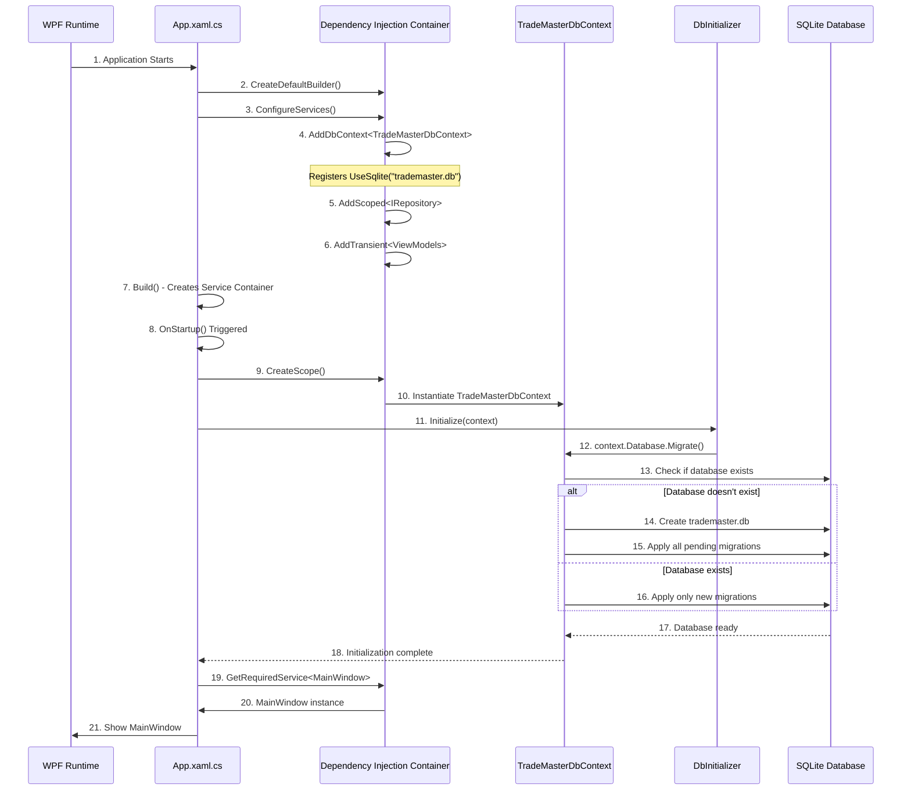

# TradeMaster - Code Workflow & Architecture Guide

**Author**: Sangam Baral  
**Role**: Software Engineer  
**Version**: 1.0

---

## 🏗️ Architecture Overview

TradeMaster follows the **Clean Architecture** principles combined with the **MVVM (Model-View-ViewModel)** design pattern. This ensures a strict separation of concerns, making the code testable, maintainable, and scalable.

### High-Level Structure

The solution is divided into three distinct layers (Projects):

1.  **TradeMaster.Core** (The "Heart")
    *   Contains the business entities (e.g., `Product`, `Sale`, `Customer`).
    *   Defines Interfaces (e.g., `IRepository<T>`).
    *   *No external dependencies* (Pure C#).

2.  **TradeMaster.Infrastructure** (The "Plumbing")
    *   Implements the Interfaces defined in Core.
    *   Handles Database connections using **Entity Framework Core** (EF Core).
    *   Contains the `TradeMasterDbContext`.

3.  **TradeMaster.Desktop** (The "Face")
    *   The WPF Application (Frontend).
    *   Contains Views (XAML) and ViewModels (C# logic).
    *   Handles Dependency Injection (DI) to glue everything together.

---

## 🔄 Data Flow: How It Works

Here is the journey of a data request through the application:

```mermaid
graph TD
    User[👤 User Action] --> View[🖥️ View (UI/XAML)]
    View -->|Data Binding| ViewModel[🧠 ViewModel (Logic)]
    ViewModel -->|Calls Interface| Repository[🗄️ Repository (Data Access)]
    Repository -->|EF Core / ADO.NET| DB[(💾 SQLite Database)]
    DB -->|Results| Repository
    Repository -->|Entities| ViewModel
    ViewModel -->|Property Change| View
    View -->|Visual Update| User
```

---

## 🛠️ Detailed Component Breakdown

### 1. Frontend (The View)
*   **Technology**: WPF (Windows Presentation Foundation) with XAML.
*   **Role**: Displays data and captures user input.
*   **Key Concept**: **Data Binding**. The View never talks to the database directly. It only knows about the `ViewModel`.
*   **Example**: `CustomerListView.xaml` defines the grid and buttons, but doesn't know *how* to delete a customer. It just binds to the `DeleteCustomerCommand`.

### 2. Backend Logic (The ViewModel)
*   **Technology**: C# with CommunityToolkit.Mvvm.
*   **Role**: Holds the state of the view and handles logic.
*   **Key Concept**: **ObservableObject**. When data changes here (e.g., `_customers` collection), it automatically notifies the UI to update.
*   **Example**: `CustomerListViewModel.cs` has a method `LoadCustomers()`. It asks the Repository for data, puts it in a list, and the UI updates automatically.

### 3. Database Layer (EF Core & ADO.NET)
*   **Technology**: Entity Framework Core (EF Core) 9.0.
*   **Role**: Translates C# objects into SQL commands.
*   **How it relates to ADO.NET**:
    *   You asked about **ADO.NET**. EF Core is a modern wrapper *built on top of* ADO.NET.
    *   Instead of writing raw SQL (e.g., `SELECT * FROM Customers`), we write C# code: `_context.Customers.ToList()`.
    *   **Under the hood**, EF Core converts this C# code into a raw ADO.NET SQL command, opens a connection, executes the query, and maps the results back to C# objects.

---

## 👣 Step-by-Step Workflow Example

Let's trace exactly what happens when you click **"Save Customer"**:

### Step 1: User Interaction (Frontend)
*   **User** fills in the "Name" and "Email" fields in `CustomerEditDialog.xaml`.
*   **User** clicks the "Save" button.
*   **Event**: `SaveButton_Click` event is triggered in the code-behind.

### Step 2: Logic Processing (ViewModel/Code-Behind)
*   The code creates a new `Customer` entity object:
    ```csharp
    var newCustomer = new Customer { Name = "John Doe", Email = "john@example.com" };
    ```
*   The code calls the repository:
    ```csharp
    await _customerRepository.AddAsync(newCustomer);
    ```

### Step 3: Data Access (Infrastructure)
*   The `EfRepository` receives the `Customer` object.
*   It adds it to the `TradeMasterDbContext`:
    ```csharp
    _dbContext.Set<Customer>().Add(entity);
    ```
*   It saves changes:
    ```csharp
    await _dbContext.SaveChangesAsync();
    ```

### Step 4: Database Execution (EF Core -> SQL)
*   **Translation**: EF Core translates the C# object into an SQL `INSERT` statement.
*   **Execution**: It opens a connection to `trademaster.db` (SQLite).
*   **Commit**: The data is written to the disk.

### Step 5: UI Update (Return Trip)
*   The `AddAsync` method completes.
*   The dialog closes.
*   The `CustomerListViewModel` refreshes the list (`LoadCustomers`).
*   The **DataGrid** on the screen detects the new item and displays "John Doe".

---

## 🔌 Dependency Injection (The Glue)

How does the app know which database to use? This is handled in `App.xaml.cs`.

This is the "Startup" configuration where we wire everything together:

```csharp
// 1. Configure Database
services.AddDbContext<TradeMasterDbContext>(options => 
    options.UseSqlite("Data Source=trademaster.db"));

// 2. Link Interfaces to Implementations
// "Whenever a class asks for IRepository, give them EfRepository"
services.AddScoped(typeof(IRepository<>), typeof(EfRepository<>));

// 3. Register ViewModels
services.AddTransient<CustomerListViewModel>();
```

This ensures that `CustomerListViewModel` doesn't need to know *how* to connect to the database; it just asks for a repository, and the system provides it.

---

## 📂 Folder Structure Guide

*   `TradeMaster.Core/`
    *   `Entities/` -> Defines *what* data we have (Product.cs, Customer.cs).
    *   `Interfaces/` -> Defines *what* operations we can do (IRepository.cs).
*   `TradeMaster.Infrastructure/`
    *   `Data/` -> Implements the database connection (DbContext, EfRepository).
    *   `Migrations/` -> History of database changes.
*   `TradeMaster.Desktop/`
    *   `Views/` -> The visual windows (XAML files).
    *   `ViewModels/` -> The logic behind the windows.
    *   `App.xaml.cs` -> The startup configuration.

---

## 🔗 Database Connection Flow (Complete Journey)

This section explains **exactly** how the database gets connected and how data flows through the entire system.

### Phase 1: Application Initialization



### Connection String Configuration

**Location**: `App.xaml.cs` (Line 24)

```csharp
services.AddDbContext<TradeMasterDbContext>(options =>
{
    options.UseSqlite("Data Source=trademaster.db");
});
```

**How it works**:
1. **AddDbContext**: Registers the DbContext with the DI container
2. **UseSqlite**: Configures EF Core to use SQLite provider
3. **"Data Source=trademaster.db"**: Connection string pointing to the database file
   - This creates/uses a file named `trademaster.db` in the application's root directory

### DbContext Lifecycle

**File**: `TradeMaster.Infrastructure/Data/TradeMasterDbContext.cs`

```csharp
public class TradeMasterDbContext : DbContext
{
    // DbSet properties represent database tables
    public DbSet<Product> Products { get; set; }
    public DbSet<Category> Categories { get; set; }
    public DbSet<Sale> Sales { get; set; }
    public DbSet<SaleItem> SaleItems { get; set; }
    public DbSet<Customer> Customers { get; set; }

    // Constructor receives configuration from DI
    public TradeMasterDbContext(DbContextOptions<TradeMasterDbContext> options) 
        : base(options)
    {
        // Configuration is injected here
    }

    // Fallback configuration (used for migrations)
    protected override void OnConfiguring(DbContextOptionsBuilder optionsBuilder)
    {
        if (!optionsBuilder.IsConfigured)
        {
            optionsBuilder.UseSqlite("Data Source=trademaster.db");
        }
    }
}
```

**Key Points**:
- **DbSet<T>**: Each DbSet represents a table in the database
- **Constructor Injection**: Options come from `App.xaml.cs` configuration
- **OnConfiguring**: Fallback for when no DI is available (migrations, testing)

---

## 🚀 Complete Application Flow (Start to End)

### 🔵 Step 1: WPF Application Launches

**File**: `TradeMaster.Desktop/App.xaml`
```xml
<Application x:Class="TradeMaster.Desktop.App"
             StartupUri="MainWindow.xaml">
    <!-- But we override this with code-based startup -->
</Application>
```

**File**: `TradeMaster.Desktop/App.xaml.cs`
```csharp
public App()
{
    // This runs BEFORE the window shows
    AppHost = Host.CreateDefaultBuilder()
        .ConfigureServices((hostContext, services) => { ... })
        .Build();
}
```

### 🔵 Step 2: Dependency Injection Container Setup

**What gets registered**:

| Service Type | Implementation | Lifetime | Purpose |
|-------------|----------------|----------|---------|
| `TradeMasterDbContext` | `TradeMasterDbContext` | Scoped | Database connection |
| `IRepository<T>` | `EfRepository<T>` | Scoped | Generic data access |
| `ISaleRepository` | `SaleRepository` | Scoped | Specialized sale queries |
| `ProductListViewModel` | `ProductListViewModel` | Transient | Product management logic |
| `PosViewModel` | `PosViewModel` | Transient | POS logic |
| `CustomerListViewModel` | `CustomerListViewModel` | Transient | Customer management logic |
| `SalesHistoryViewModel` | `SalesHistoryViewModel` | Transient | Sales history logic |
| `MainWindow` | `MainWindow` | Singleton | Main application window |

**Scoped vs Transient vs Singleton**:
- **Scoped**: One instance per request/scope (database operations)
- **Transient**: New instance every time (lightweight ViewModels)
- **Singleton**: One instance for the entire application (MainWindow)

### 🔵 Step 3: Database Initialization

**File**: `TradeMaster.Infrastructure/Data/DbInitializer.cs`

```csharp
public static void Initialize(TradeMasterDbContext context)
{
    // This applies all pending migrations
    context.Database.Migrate();
    
    // Check if data already exists
    if (context.Products.Any())
    {
        return; // Database already seeded
    }
    
    // Seed data is defined in OnModelCreating
}
```

**What Migrate() does**:
1. Checks the `__EFMigrationsHistory` table
2. Compares applied migrations vs available migrations
3. Executes SQL for any missing migrations
4. Updates the history table

### 🔵 Step 4: Main Window Display

```csharp
protected override async void OnStartup(StartupEventArgs e)
{
    await AppHost!.StartAsync();
    
    // Database initialization happens here
    using (var scope = AppHost.Services.CreateScope())
    {
        var context = scope.ServiceProvider.GetRequiredService<TradeMasterDbContext>();
        DbInitializer.Initialize(context);
    }
    
    // Now show the window
    var startupForm = AppHost.Services.GetRequiredService<MainWindow>();
    startupForm.Show();
    
    base.OnStartup(e);
}
```

---

## 📊 Complete Data Operation Flow

Let's trace a **complete CRUD operation** from UI to Database and back.

### Example: Adding a New Customer

#### 1️⃣ User Action (UI Layer)

**File**: `CustomerListView.xaml.cs`

```csharp
private async void AddCustomer_Click(object sender, RoutedEventArgs e)
{
    // Create dialog
    var dialog = new CustomerEditDialog();
    
    // Show modal dialog
    if (dialog.ShowDialog() == true)
    {
        // User clicked "Save"
        var newCustomer = dialog.Customer; // Customer object from dialog
        
        // Call ViewModel method
        await _viewModel.AddCustomerAsync(newCustomer);
    }
}
```

#### 2️⃣ ViewModel Processing (Logic Layer)

**File**: `CustomerListViewModel.cs`

```csharp
public async Task AddCustomerAsync(Customer customer)
{
    try
    {
        // Call repository (abstraction layer)
        await _customerRepository.AddAsync(customer);
        
        // Refresh the list to show new customer
        await LoadCustomersAsync();
    }
    catch (Exception ex)
    {
        // Error handling
        MessageBox.Show($"Error: {ex.Message}");
    }
}
```

#### 3️⃣ Repository Layer (Data Access)

**File**: `EfRepository.cs`

```csharp
public async Task<Customer> AddAsync(Customer entity)
{
    // Add to DbContext (in-memory tracking)
    _dbContext.Set<Customer>().Add(entity);
    
    // Save to database (actual SQL execution)
    await _dbContext.SaveChangesAsync();
    
    // Return the entity with generated ID
    return entity;
}
```

**What happens internally**:
```csharp
// 1. EF Core tracks the new entity
_dbContext.Entry(entity).State = EntityState.Added;

// 2. SaveChangesAsync() triggers:
//    - Transaction begins
//    - SQL: INSERT INTO Customers (Name, Email, Phone, Address, CreatedDate) 
//           VALUES ('John Doe', 'john@example.com', '1234567890', '123 Street', '2025-12-03')
//    - Transaction commits
//    - Entity.Id gets populated with the generated ID

// 3. Change tracker updates
_dbContext.Entry(entity).State = EntityState.Unchanged;
```

#### 4️⃣ Database Execution (SQLite)

**Physical Process**:
1. EF Core generates SQL command
2. Opens connection to `trademaster.db` file
3. Begins transaction
4. Executes INSERT statement
5. Retrieves auto-generated ID (AUTOINCREMENT)
6. Commits transaction
7. Closes connection
8. Returns affected rows count

#### 5️⃣ UI Update (Return Journey)

```csharp
// In ViewModel:
await LoadCustomersAsync(); // This triggers:

// 1. Query database
var customers = await _customerRepository.ListAllAsync();

// 2. Update ObservableCollection
Customers.Clear();
foreach (var customer in customers)
{
    Customers.Add(customer);
}

// 3. UI automatically updates due to data binding
// The DataGrid is bound to the Customers collection
// Any change to this collection triggers UI refresh
```

---

## 🗄️ Migration System Explained

### What are Migrations?

Migrations are version control for your database schema. They track changes over time.

### Migration Files Structure

**Location**: `TradeMaster.Infrastructure/Migrations/`

```
Migrations/
├── 20251202160407_AddCustomerEntity.cs          # The migration code
├── 20251202160407_AddCustomerEntity.Designer.cs # Metadata
└── TradeMasterDbContextModelSnapshot.cs         # Current state
```

### Migration File Breakdown

**File**: `20251202160407_AddCustomerEntity.cs`

```csharp
public partial class AddCustomerEntity : Migration
{
    protected override void Up(MigrationBuilder migrationBuilder)
    {
        // This runs when applying the migration
        migrationBuilder.CreateTable(
            name: "Sales",
            columns: table => new
            {
                Id = table.Column<int>(nullable: false)
                    .Annotation("Sqlite:Autoincrement", true),
                SaleDate = table.Column<DateTime>(),
                TotalAmount = table.Column<decimal>(type: "decimal(18,2)"),
                CustomerName = table.Column<string>(maxLength: 100),
                CustomerId = table.Column<int>(nullable: true)  // ⬅️ FOREIGN KEY
            });
            
        migrationBuilder.CreateIndex(
            name: "IX_Sales_CustomerId",
            table: "Sales",
            column: "CustomerId");
            
        migrationBuilder.AddForeignKey(
            name: "FK_Sales_Customers_CustomerId",
            table: "Sales",
            column: "CustomerId",
            principalTable: "Customers",
            principalColumn: "Id");
    }
    
    protected override void Down(MigrationBuilder migrationBuilder)
    {
        // This runs when rolling back the migration
        migrationBuilder.DropTable(name: "Sales");
    }
}
```

### Migration History Tracking

**Table**: `__EFMigrationsHistory`

| MigrationId | ProductVersion |
|-------------|----------------|
| 20251202160407_AddCustomerEntity | 9.0.0 |

**How it works**:
- When `context.Database.Migrate()` runs, it checks this table
- Compares with migration files in the project
- Applies only the migrations not in this table

---

## 🐛 Debugging Guide: How to Trace Issues

### 🔍 Debug Point 1: Application Startup

**Set breakpoint in**: `App.xaml.cs` → `OnStartup()`

```csharp
protected override async void OnStartup(StartupEventArgs e)
{
    // ⬅️ BREAKPOINT HERE
    await AppHost!.StartAsync();
    
    using (var scope = AppHost.Services.CreateScope())
    {
        var context = scope.ServiceProvider.GetRequiredService<TradeMasterDbContext>();
        // ⬅️ BREAKPOINT HERE - Check if context is created
        DbInitializer.Initialize(context);
    }
}
```

**What to inspect**:
- `AppHost` should not be null
- `scope.ServiceProvider` should contain all registered services
- `context.Database.CanConnect()` should return true

### 🔍 Debug Point 2: Database Connection

**Set breakpoint in**: `TradeMasterDbContext.cs` → Constructor

```csharp
public TradeMasterDbContext(DbContextOptions<TradeMasterDbContext> options) 
    : base(options)
{
    // ⬅️ BREAKPOINT HERE
    // Inspect 'options' to see connection string
}
```

**What to check**:
- `options.Extensions` should contain SqliteOptionsExtension
- Connection string should point to `trademaster.db`

### 🔍 Debug Point 3: Migration Execution

**Set breakpoint in**: `DbInitializer.cs` → `Initialize()`

```csharp
public static void Initialize(TradeMasterDbContext context)
{
    // ⬅️ BREAKPOINT HERE
    context.Database.Migrate();
    
    // ⬅️ BREAKPOINT HERE - Check if migration succeeded
    if (context.Products.Any())
    {
        return;
    }
}
```

**What to verify**:
- `context.Database.GetPendingMigrations()` should be empty after Migrate()
- `context.Database.GetAppliedMigrations()` should list all migrations

### 🔍 Debug Point 4: Data Operations

**Set breakpoint in**: `EfRepository.cs` → `AddAsync()`

```csharp
public async Task<T> AddAsync(T entity)
{
    // ⬅️ BREAKPOINT HERE - Check entity values
    _dbContext.Set<T>().Add(entity);
    
    // ⬅️ BREAKPOINT HERE - Check if entity is being tracked
    await _dbContext.SaveChangesAsync();
    
    // ⬅️ BREAKPOINT HERE - Check if ID was generated
    return entity;
}
```

**Use Immediate Window**:
```csharp
// Check tracked entities
_dbContext.ChangeTracker.Entries()

// Check entity state
_dbContext.Entry(entity).State

// Generate SQL without executing
_dbContext.Database.GenerateCreateScript()
```

### 🔍 Debug Point 5: ViewModel to UI

**Set breakpoint in**: `CustomerListViewModel.cs`

```csharp
private async Task LoadCustomersAsync()
{
    var customers = await _customerRepository.ListAllAsync();
    // ⬅️ BREAKPOINT HERE - Check customers count
    
    Customers.Clear();
    foreach (var customer in customers)
    {
        Customers.Add(customer);
        // ⬅️ BREAKPOINT HERE - Check each customer
    }
}
```

**What to watch**:
- `customers.Count()` - Should match database records
- `Customers` collection should trigger PropertyChanged events
- UI should update automatically (check DataGrid ItemsSource binding)

---

## 🔧 Common Issues & Solutions

### Issue 1: "Table X has no column named Y"

**Cause**: Database schema doesn't match entity model

**Solution**:
```powershell
# Delete old database
Remove-Item trademaster.db*

# Run application - migrations will recreate database
dotnet run --project TradeMaster.Desktop
```

### Issue 2: "No DbContext was found"

**Cause**: DbContext not registered in DI container

**Check**: `App.xaml.cs` → `ConfigureServices()`
```csharp
services.AddDbContext<TradeMasterDbContext>(options => 
    options.UseSqlite("Data Source=trademaster.db"));
```

### Issue 3: "SaveChanges() not persisting data"

**Cause**: Not using the same DbContext instance

**Solution**: Ensure using Scoped lifetime and proper DI
```csharp
// ❌ WRONG - Creates new context
var context = new TradeMasterDbContext();

// ✅ CORRECT - Uses DI container
var context = scope.ServiceProvider.GetRequiredService<TradeMasterDbContext>();
```

### Issue 4: "Foreign key constraint failed"

**Cause**: Trying to insert Sale with non-existent CustomerId

**Solution**: Check CustomerId exists before saving
```csharp
if (sale.CustomerId.HasValue)
{
    var customerExists = await _context.Customers
        .AnyAsync(c => c.Id == sale.CustomerId.Value);
    
    if (!customerExists)
    {
        sale.CustomerId = null; // Use null if customer doesn't exist
    }
}
```

---

## 📈 Performance Tips

### 1. Use AsNoTracking for Read-Only Queries

```csharp
// Faster for read-only operations
var customers = await _context.Customers
    .AsNoTracking()
    .ToListAsync();
```

### 2. Eager Loading for Related Data

```csharp
// Load sales with items in one query
var sales = await _context.Sales
    .Include(s => s.Items)
    .Include(s => s.Customer)
    .ToListAsync();
```

### 3. Batch Operations

```csharp
// Instead of multiple SaveChanges
foreach (var product in products)
{
    _context.Products.Add(product);
}
await _context.SaveChangesAsync(); // Single database round-trip
```

---

## 🎯 Quick Reference: Key Files for Debugging

| Issue Type | File to Check | What to Look For |
|------------|---------------|------------------|
| App won't start | `App.xaml.cs` | DI configuration, startup flow |
| DB connection fails | `TradeMasterDbContext.cs` | Connection string, OnConfiguring |
| Data not saving | `EfRepository.cs` | SaveChangesAsync calls |
| UI not updating | ViewModel files | ObservableCollection, PropertyChanged |
| Migration errors | `Migrations/` folder | Up/Down methods, foreign keys |
| Schema mismatch | `DbInitializer.cs` | Migrate() vs EnsureCreated() |

---

**End of Documentation**
